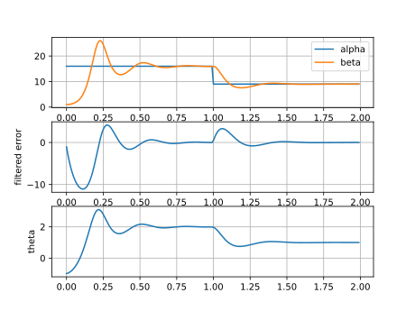
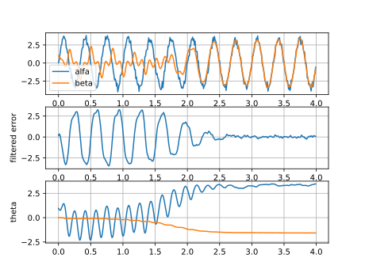

- [<span class="toc-section-number">1</span>
  Introduction](#introduction)
  - [<span class="toc-section-number">1.1</span> Notation](#notation)
- [<span class="toc-section-number">2</span> In a
  Nutshell](#in-a-nutshell)
- [<span class="toc-section-number">3</span> EFOL](#efol)
  - [<span class="toc-section-number">3.1</span> Goal](#goal)
  - [<span class="toc-section-number">3.2</span> Error
    Function](#error-function)
  - [<span class="toc-section-number">3.3</span> Filtering with
    LTI](#filtering-with-lti)
  - [<span class="toc-section-number">3.4</span> Expansion of
    u(t)](#expansion-of-ut)
  - [<span class="toc-section-number">3.5</span> Control
    Law](#control-law)
- [<span class="toc-section-number">4</span> Examples](#examples)
  - [<span class="toc-section-number">4.1</span> Example 1](#example-1)
  - [<span class="toc-section-number">4.2</span> Example 2](#example-2)
- [<span class="toc-section-number">5</span> How to use
  it](#how-to-use-it)
  - [<span class="toc-section-number">5.1</span> Deadzone](#deadzone)

# Introduction

The Error Filtering Online Learning (EFOL) was conceived as a scheme to cope
with unkowns not modelled in dynamic systems when the intention is to control
such systems. For example, a dynamic system might have a drift in its behavior
due to temperature, dirt, light, which not always can be modelled. Aiming at
robustness, the alternative in these cases is to enable an adaptive scheme to
compensate the effect of the missing part of the model at the controller.

To my best knowledge, the first time EFOL was published dates 2010, or at least
the first lines of it, by Mr. Marios Polycarpou in "Stable Adaptive Neural
Control Scheme for Nonlinear Systems", but the best reference for it is the
book "Adaptive Approximation Based Control" from Mr. Farrell and Mr.
Polycarpou.

## Notation

- Underlined variables are vectors or matrices.
- A hat will be on the top of approximations or approximators. For example,
    $\hat{f}\left(\hat{\theta}\right)$ has an approximator function $\hat{f}$
    characterized by the approximation parameter $\hat{\theta}$.
- A superscripted triangle points to the best choice of a parameter:
    $\theta^{\triangle}$.
- The vector $\underline{z}(t)$ collects all states and internal variables of
    the system model at instant $t$.

# In a Nutshell

In case you are not familiar with the concept of EFOL, consider a model
represented by a equality, where the LHS of the equality collects what you can
"see" and measure from a system. And the RHS collects what is not known or any
characteristics of the system that changes with time. For example,
$\alpha(t)=0$ represents a system fully described, while $\alpha(t)=\beta(t)$
means a part of the system could not be fully modeled and this uncertainty is
hidden in $\beta(t)$. The trick now is to approximate $\beta(t)$, and adapt its
internal parameters online to have always the best match between $\alpha(t)$
and $\beta(t)$.

# EFOL

## Goal

Let a function $\underline{\hat{f}}$ be the approximation function. It can be
either a linear, or a nonlinear (eg. as a multilayered neural network)
approximator.

Let:

$$
\underline{\alpha}(t) = \underline{\hat{f}}(\underline{z}(t);\underline{\theta}^{\triangle})
                            + \underline{\delta}(t)
$$

with $\underline{\delta}(t)$ being the part of $\underline{\alpha}(t)$ not
covered by $\underline{\hat{f}}$ despite the selection of the best parameters
$\underline{\theta}^{\triangle}$. And let:

$$ \underline{\beta} = \underline{\hat{f}} (\underline{z}(t); \underline{\hat{\theta}}) $$

the estimator dependent on the parameters $\underline{\hat{\theta}}$. As an
online learning process, $\underline{\hat{\theta}}$ will be estimated on the
fly in a way that the error

$$ \underline{u}(t) = \underline{\beta}(t) - \underline{\alpha}(t) $$

continously decreases.

## Error Function

Based on the definition of $\underline{\alpha}(t)$, we shall rewrite $\underline{u}(t)$ as:

$$
\underline{u}(t) = 
    \underline{\hat{f}} (\underline{z}(t); \underline{\hat{\theta}}) -
    \underline{\hat{f}}(\underline{z}(t);\underline{\theta}^{\triangle}) - \underline{\delta}(t)
$$

but we will assign the task to fix the mismatch between $\underline{\alpha}(t)$
and the respective $\underline{\hat{f}}(\cdot)$ to the approximator in
$\underline{\beta}(t)$. Hence:

$$
\underline{u}(t) = 
    \underline{\hat{f}} (\underline{z}(t); \underline{\hat{\theta}}) -
    \underline{\hat{f}}(\underline{z}(t);\underline{\theta}^{\triangle})
$$

## Filtering with LTI

We need a solution that provides both:

- stable and continuous tracking of a signal, and
- a closed algebraic equation for the first-derivative of the tracked signal.

and we can achieve it with Linear Time-Invariant filters.

Using the Laplace notation for LTI filters, let:

$$ \underline{e}(t) = \mathbb{W} [s] ( \underline{u}(t) ) $$

be the signal tracking $\underline{u}(t)$ at the output of the filter $\mathbb{W}[s]$.
The selection of the filter is not important. Now we just need the first derivative, and
therefore we pick this filter:

$$ \mathbb{W}[s] = \frac{\lambda}{s+\lambda} $$

with $\lambda \in \mathbb{R}^{+}$. The differential equation of the output of the filter is:

$$ \underline{\dot{e}}(t) = -\lambda \underline{e}(t) + \lambda \underline{u}(t) $$

## Expansion of u(t)

Here we present an alternative to have $\underline{u}(t)$ as a function of $\underline{\tilde{\theta}}$:

$$
\begin{aligned}
    \underline{u}(t) & = 
        \underline{\hat{f}} (\underline{z}(t); \underline{\hat{\theta}}) -
        \underline{\hat{f}}(\underline{z}(t);\underline{\theta}^{\triangle}) \\
        & = 
            \underline{\hat{f}} (\underline{z}(t); \underline{\hat{\theta}}) -
            \underline{\hat{f}}(\underline{z}(t);\underline{\hat{\theta}} - \underline{\tilde{\theta}}) \\
        & =
            \underline{\hat{f}} (\underline{z}(t); \underline{\hat{\theta}}) -
            \underline{\hat{f}}(\underline{z}(t);\underline{\hat{\theta}}) +
            \frac{\partial \underline{\hat{f}}}{\partial \underline{\theta}} (\underline{z}(t); \underline{\hat{\theta}}) \cdot
            \underline{\tilde{\theta}}  +  \mathfrak{F} \\
        & \simeq \underline{H}_ {\theta} \cdot \underline{\tilde{\theta}} 
\end{aligned}
$$

## Control Law

The next step is to find a control law for $\underline{\hat{\theta}}$. This is
achieved using Lyapunov to force the absolute value of the filtered error
$\underline{e}(t)$ and the parameters errors $\underline{\tilde{\theta}}$
continuously to decrease. We select the following cost function:

$$ V(t) = \frac{1}{2\lambda} \underline{e}^T \underline{\Gamma}_ e \underline{e} +
            \frac{1}{2} \underline{\tilde{\theta}}^T \underline{\Gamma}_ \theta^{-1} \underline{\tilde{\theta}} $$

where $\underline{\Gamma}_ e$ and $\underline{\Gamma}_ \theta$ are positive semidefinite matrices. After differentiating
the cost function, one gets the control law for $\underline{\hat{\theta}}$:

$$ \underline{\dot{\hat{\theta}}} = - \underline{\Gamma}_ \theta \underline{H}_ {\theta}^T \underline{\Gamma}_ e \underline{e} $$

This equation is implemented in discrete form in the package `kEfol`.

# Examples

Here we present two ilustrative examples of EFOL in action.

## Example 1

The signal to follow is

$\alpha(t) =$ 16. if t < 1.0 else 9.0, plus noise.

The model we will use is

$\beta(t) = (2.0 + \theta)^{2}$

The result is depicted in the next figure.



## Example 2

The signal to follow is

$\alpha(t) = 3.3  \sin(2 \pi 3 t)$ plus noise.

The Model here will be:

$\beta(t) = \theta_{0}  \cos(2 \pi 3 t + \theta_{1})$

The next graph depicts the results.




# How to use it

As a reference for any application of the class, the examples presented above
are include as part of the test package.

The initialization is done with:

| **argument** | **type** | **description** |
| -----------: | :------: | :-------------- |
| `filterpole` | float or list | The value(s) for $\lambda$. If scalar, the filters for each element in the error vector will be equal. |
| `dim_error`  | int      | Dimension of either $\underline{\alpha}(t)$, or $\underline{\beta}(t)$ or $\underline{e}(t)$. |
| `theta0`     | float or iteratable | Value of $\underline{\theta}(t=0)$. |
| `Ts`         | float    | Time step [s] |
| `Gamma_theta` | float or iteratable | Matrix $\underline{\Gamma}_{\theta}$. |
| `Gamma_error` | float or iteratable | Matrix $\underline{\Gamma}_{e}$. This is optional. |
| `fn_deadzone` | function | see below |

The update steps receives $\underline{\alpha}(t)$, $\underline{\beta}(t)$ and the Hessian matrix, which
shall be calculated beforehand, like this:

```python
theta = kEfol().update(alpha, beta, hessian)
```

As $\underline{\beta}(t)$ depends on the estimations $\underline{\theta}$
at the instant $[k-1]$, the `update()` method returns $\underline{\theta}[k]$.

## Deadzone

as the error goes to zero, there is a chance that the last integration step
forces a change at the sign of the error elements rather bringing it to zero.
at the next update cycle, the change direction will be reversed, and a again
the error sign may change. this oscillation around the zero can be suppressed
by blocking any updates on $\theta$ as the error reaches a small region around
zero: the so called **deadzone**. The behavior resembles the *limit cycle* in
the theory of dynamic system control.

Before calculating the next $\theta$, the class offers a chance to influence
the next update. It calls a function pointed by `fn_deadzone` which receives
the current value of the filtered error, and expects as a return a list of
weigths to have multiplied by each element in the error vector before the next
update. If the returned list contains only zeros, no update will be perfomed.

